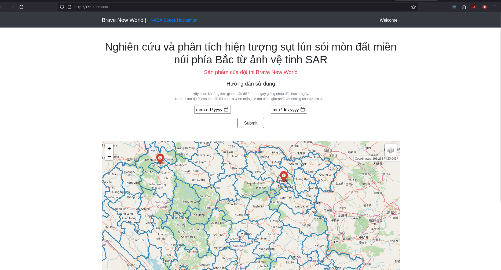
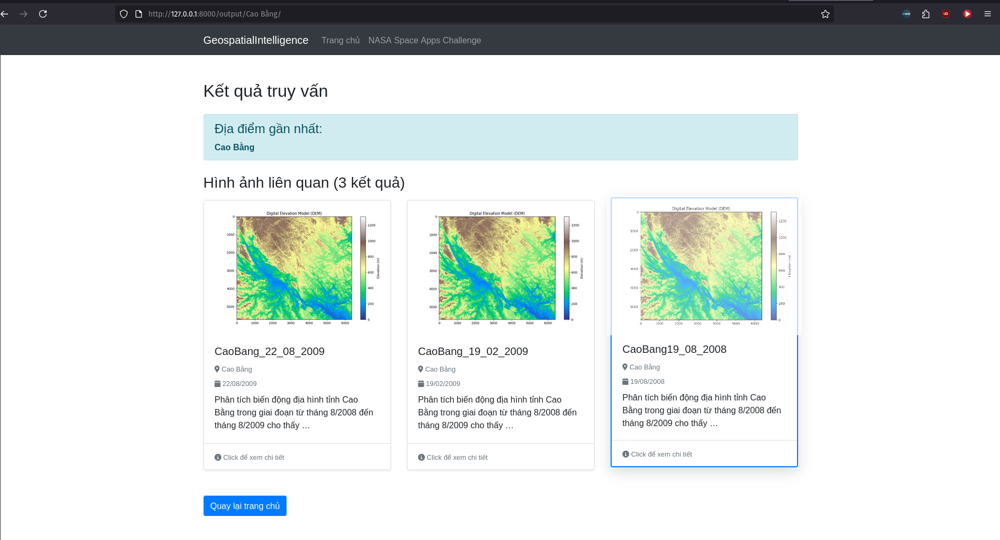
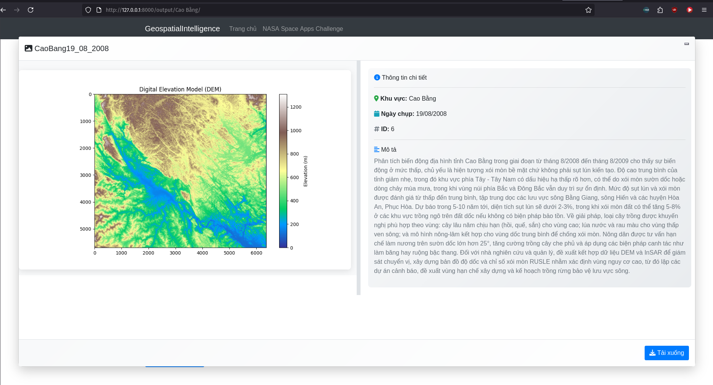

# Land subsidence tracking system - Brave New World

## About us and our project

We are Brave New World, a team of students from SPARC Lab, Hanoi University of Science and 
Techonology participating in this year NASA Space Apps Challenge 2025.

This is our website built with Django intended to be used for analysis of land subsidence.
Right now, the supported location are Cao Bang, Ha Giang and Son La of Vietnam, and please choose a 
time range that has the year 2007 to 2009.

Currently, our website is deployed on flyio: https://bravenewworld-sparc.fly.dev/
Please note that the website is kinda slow since we didn't spend much on the service as the web is still a 2-day project 
and not fully completed. If  you use it, please select Cao Bang and the range date should include the year 2009.

The user can pick a location on the map and the system will detect the if the data is available for
that location. The date range is also needed so the outdated data can be removed. 

Since computing from raw SLC images from satellites can be resource-extensive, we 
have already processed some data for the locations above. The satellite we are using is ALOS PALSAR.

The data that is displayed on our website is processed by ESA SNAP for DEM (Digital Elevation Model) and ArcScene for 3D model (only available in image file).

## Contribution
You can contribute to the project by cloning this repo and run it.
You need postgresql with PostGis extension.

Additionally, we would also like to combine Machine Learning or AI model for land subsidence 
prediction, but we haven't been able to implement such a model in such a short time

Anyways, to run the code

```
pip freeze > requirementrequirements.txt
cd ./geoview
python manage.py runserver
```

## Illustration




